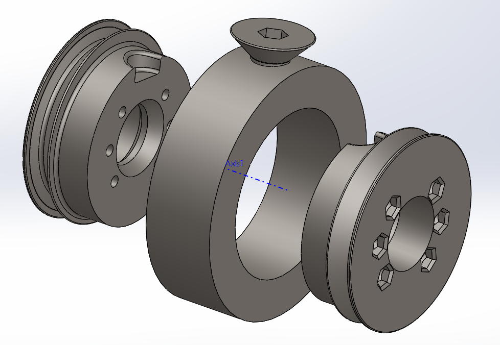

# Shaft Collar Weapon:

Video of weapon in action:  https://www.youtube.com/watch?v=2M8aIPILqEA

# Parts Required for Included design:
* 3d printed hubs in the requisite size
* 40mm length M3 countersunk bolts
* M3 Nylock nuts
* 608 "Skateboard" ball bearings
* Requisite size steel shaft collar
* Requisite size countersunk bolt, Length should be the shortest size that still sits proud of the inner race of the shaft collar.
* 1/8 diameter O-Ring, sized so that it stretches around 30% when stretched onto both pulleys.

# Integration Requirements:
* Weapon motor/pulley, I've included STL's for the pulley I use.  Which mates to a GARTT 2212 920kv motor with the plain can (no integrated prop addapter)
* 8mm weapon shaft/spacers/mounting

# Design Recomendations:
* The 2 inch shaft collar + hub weighs just shy of 20oz.
* The 1.875 shaft collar + hub weighs just shy of 17oz.
* I typically buy collars in 4 packs on ebay.  The 2 inch collar is a very common size and my per-unit cost is typically around 4$
* The motor I reccomend with the included pulley STL's is capable of starting from stall with the robot sitting with 100% of its weight on the weapon (at 4s, 30a esc)
* I reccomend spinning the weapon around 2,500-7,000 rpm, Faster speeds typically throw O-rings, and because the mass/moment of the weapon is so optimized, it really doesn't need crazy RPM's to do damage.
* Note that the hub includes 2 pulleys for 2 O-rings.  For higher tip speeds, I've used dual 2212 1400kv motors to increase the power to the weapon.
* The weapon hub can generally be printed from any type of plastic and it will usually hold up fine without breaking.  The bigger problem is heat.  PLA hubs will melt in a long match as the Oring friction builds up.
